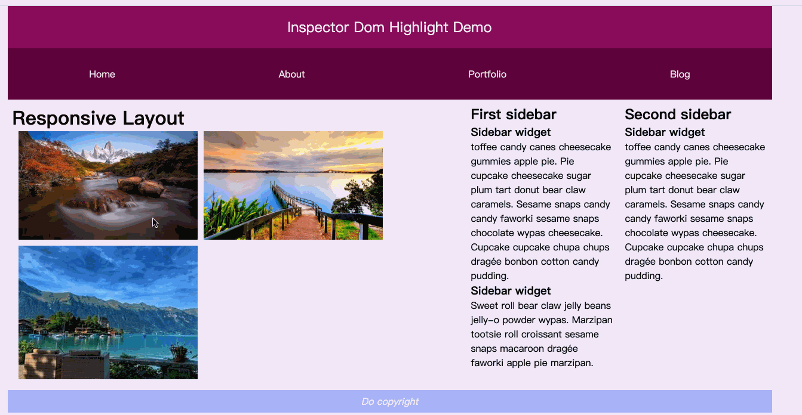

# Inspector Dom2

Pure vanilla-js ultra-lightweight dom inspector similiar to built-in tool in chrome browser with a custom callback onClick.
, based on [Inspector Dom](https://github.com/mbondyra/inspector-dom) changed.

## Install

yarn add inspector-dom2

`const Inspector = require('inspector-dom')`

`import Inspector from 'inspector-dom'`

## Usage

Initialize:

`const inspector = Inspector()`

Props:

```javascript
const inspector = Inspector({
    root: 'body',                       // root element
    excluded: [],                       // excluded children, string or node Element
    included: [],                     // included always use better, and the css positive selector is supported friendly
    outlineStyle: '2px solid orange', // style
    highlightClass: 'inspector', // help developer advance the inspector highlight custom css
    onClick: el => console.log('Element was clicked:', el) //onClick callback
});
```

## API

`inspector.enable()                     // turn the inspector on`

`inspector.cancel()                     // turn the inspector off`
